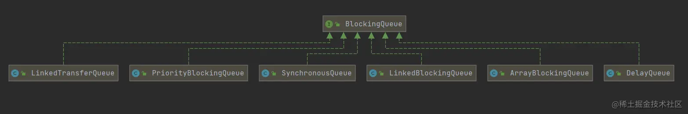
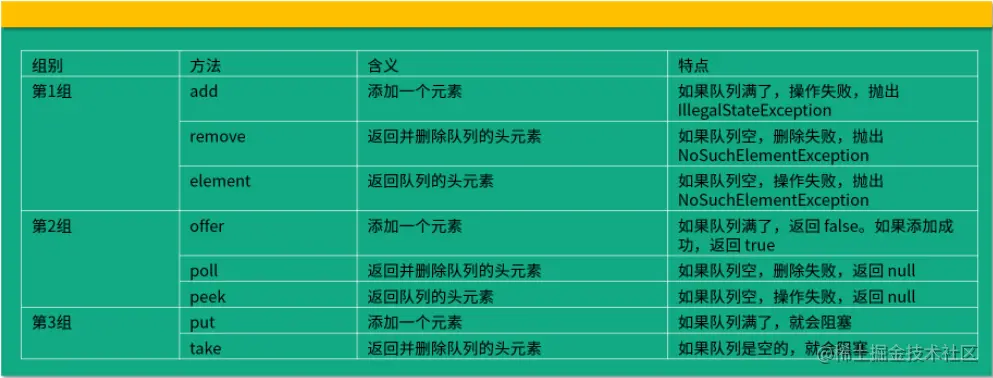

# BlockingQueue阻塞队列

阻塞队列，顾名思义，首先他是一个队列，通过一个共享队列，可以使得数据由队列的一端输入，从另一端输出；

两个线程，一个网里面放，一个从里面取，当里面为空的时候，取的线程就阻塞，当里面放满的时候放的线程就阻塞，其他情况就一个往里放另一个取

当队列是空的，从队列中获取元素的操作将会被阻塞，

当队列是满的，从队列中添加元素的操作将会被阻塞。试图从空的队列中获取元素的线程将会被阳塞，直到其他线程往空的队列插入新的元素。试图向已满的队列中添加新元素的线程将会被阻塞，直到其他线程从队列中移除一个或多 个元素或者完全清空，使队列变得空闲起来并后续新增。

其特点是当队列为空，取线程自动挂起，当队列不为空的时候取线程自动被唤醒。好处是我们不需要关心什么时候需要阻塞线程，什么时候需要唤醒线程，因为这一切 BlockingQueue 都给你一手包办了

## 阻塞队列的架构

<a href="https://juejin.cn/post/7064028916096172039">掘金讲解</a>

接口BlockingQueue<E> 

## 常见的BlockingQueue

### ArrayBlockingQueue(常用)

基于数组的阻塞队列实现，在 Array Blocking Queue 内部，维护了一个定长数组，以便缓存队列中的数据对象，这是一个常用的阻塞队列，除了一个定长数 组外，ArrayBlockingQueue 内部还保存着两个整形变量，分别标识着队列的 头部和尾部在数组中的位置。

### LinkedBlockingQueue(常用)

基于链表的阻塞队列，同 ArrayListBlockingQueue 类似，其内部也维持着一 个数据缓冲队列（该队列由一个链表构成），当生产者往队列中放入一个数据 时，队列会从生产者手中获取数据，并缓存在队列内部，而生产者立即返回； 只有当队列缓冲区达到最大值缓存容量时(LinkedBlockingQueue 可以通过 构造函数指定该值），才会阻塞生产者队列，直到消费者从队列中消费掉一份 数据，生产者线程会被唤醒，反之对于消费者这端的处理也基于同样的原理。 而 LinkedBlockingQueue 之所以能够高效的处理并发数据，还因为其对于生 产者端和消费者端分别采用了独立的锁来控制数据同步，这也意味着在高并发 的情况下生产者和消费者可以并行地操作队列中的数据，以此来提高整个队列 的并发性能。

简单的来说就是由链表组成的有界（大小默认值为integer.MAX_VALUE）阻塞队列

### DelayQueue

DelayQueue 中的元素只有当其指定的延迟时间到了，才能够从队列中获取到 该元素。DelayQueue 是一个没有大小限制的队列，因此往队列中插入数据的 操作（生产者）永远不会被阻塞，而只有获取数据的操作（消费者）才会被阻塞.

阻塞队列API

