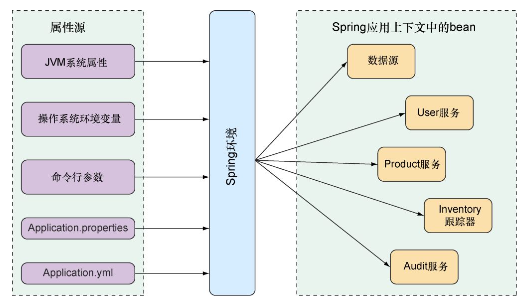
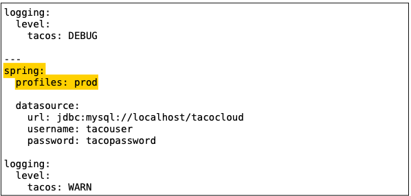

# 使用配置属性

SpringBoot提供了配置属性的方法，其实，配置属性只是Spring应用上下文中bean的属性而已，他们可以通过多个源进行设置，包括JVM属性、命令行参数以及环境变量。

Spring有两种不同但相关的配置。

+ bean装配：声明在Spring应用上下文中创建那些应用组件以及他们之间如何互相注入配置。
+ 属性注入：设置Spring应用上下文中bean的值的配置

## 理解Spring的环境抽象

Spring的环境抽象是各种配置属性的一站式服务。它抽取了原始的属性，这样需要这些属性的bean就可以从spring本身中获取了。

Spring 环境会拉去多个属性源，包括：

+ JVM系统属性
+ 操作系统环境变量
+ 命令行参数
+ 应用属性配置文件

它会将这些属性聚合到一个源中，通过这个源可以注入到Spring的bean中。



@ConfigurationProperties注解，将它放到Spring bean上之后，它就会为该bean中那些能够根据Spring环境注入值的属性赋值。https://www.cnblogs.com/tian874540961/p/12146467.html

## Spring profile

文件名遵循如下约定：application-{profile名}.yml 然后我们就可以在这里声明适用于该profile的配置属性了。

定义特定profile相关的属性的另外一种方式仅适用于YAML配置。它会将特定的profile的属性和非profile的属性都放到aplicaiton.yml中，他们之间使用三个中划线进行分割，并且使用spring.profiles属性来命名profile。如下图所示



我们可以看到，application.yml文件 通过一组中划线（---）分成了两部分，第二部分指定了spring.profiles，所以他们是所有profile通用的，或者如果当前激活的profile没有设置这些属性，他们就会作为默认值。

激活profile，如果我们不激活这些profile，声明profile相关的属性，其实没有任何用处。我们要激活某个profile，需要做的就是将profile的名称列表赋值给spring.profiles.active属性

```yaml
spring:
  profiles:
    active:
    - prod
```

但是这可能是激活profile最糟糕的一种方式。我们体验不到使用profile将生产环境相关属性和开发环境相关的属性分开的属性。因此推荐使用环境变量来设置处于激活状态的profile。

我们可以这样设置 SPRING_PROFILES_ACTIVE

```
export SPRING_PROFILES_ACTIVE=prod
```

如果以可执行JAR文件的形式运行应用，那么我们还可以以命令行参数的形式设置激活的profile

```
java -jar taco-cloud.jar --spring.profiles.active=prod

//配置多个profile
export SPRING_PROFILES_ACTIVE=prod,audit,ha
spring:
  profiles:
    active:
    - prod
    - audit
    - ha
```

## 使用profile条件化的创建bean

有时候，为不同的profile创建一组独特的bean是非常有用的。正常情况下，不管是哪个profile处于激活状态，Java配置类中声明的所有bean都会被创建。但是，假设我们希望某些bean仅在特定的profile激活的情况下才去创建。在这种情况下，@Profile注解可以将某些bean设置为仅适用于给定的profile。

如下，这个bean只有在dev的时候才会被创建

```java
@Bean
@Profile("dev")
public CommandLineRunner dataLoader(IngredientRepository repo,
      UserRepository userRepo, PasswordEncoder encoder) {
  ...
  }
//如果有多个配置文件同时激活，就这样写
@Profile({"dev", "qa"})
//h还有情况是除了这个配置文件不激活之外其他的都要激活，那就在前面加一个！
@Profile("！dev")
```


## 小结

+ Spring bean可以添加@ConfigurationProperties注解，这样就能够从多个属性源中选取一个来注入它的值
+ 配置属性可以通过命令行参数、环境变量、JVM系统属性、属性文件或YAML 文件等方式进行设置。
+ 配置属性可以用来覆盖自动配置相关的设置，包括制定数据源URL和日志级别。
+ Spring profile 可以与属性源协同使用，从而能够基于激活的profile条件化地配置设置属性。
