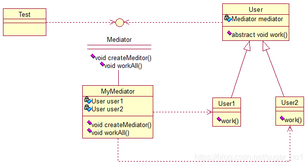

# **中介者模式（Mediator）**

中介者（Mediator）模式：定义一个中介对象来简化原有对象之间的交互关系，降低系统中对象间的耦合度，使原有对象之间不必相互了解。中介者模式也是用来降低类类之间的耦合的，因为如果类类之间有依赖关系的话，不利于功能的拓展和维护，因为只要修改一个对象，其它关联的对象都得进行修改。如果使用中介者模式，只需关心和Mediator类的关系，具体类类之间的关系及调度交给Mediator就行，这有点像spring容器的作用。先看看图：



 User类统一接口，User1和User2分别是不同的对象，二者之间有关联，如果不采用中介者模式，则需要二者相互持有引用，这样二者的耦合度很高，为了解耦，引入了Mediator类，提供统一接口，MyMediator为其实现类，里面持有User1和User2的实例，用来实现对User1和User2的控制。这样User1和User2两个对象相互独立，他们只需要保持好和Mediator之间的关系就行，剩下的全由MyMediator类来维护！基本实现：

```java
public interface Mediator {
	public void createMediator();
	public void workAll();
}
```

```java
public class MyMediator implements Mediator {
 
	private User user1;
	private User user2;
	
	public User getUser1() {
		return user1;
	}
 
	public User getUser2() {
		return user2;
	}
 
	@Override
	public void createMediator() {
		user1 = new User1(this);
		user2 = new User2(this);
	}
 
	@Override
	public void workAll() {
		user1.work();
		user2.work();
	}
}
```

```java
public abstract class User {
	
	private Mediator mediator;
	
	public Mediator getMediator(){
		return mediator;
	}
	
	public User(Mediator mediator) {
		this.mediator = mediator;
	}
 
	public abstract void work();
}
```

```java
public class User1 extends User {
 
	public User1(Mediator mediator){
		super(mediator);
	}
	
	@Override
	public void work() {
		System.out.println("user1 exe!");
	}
}
```

```java
public class User2 extends User {
 
	public User2(Mediator mediator){
		super(mediator);
	}
	
	@Override
	public void work() {
		System.out.println("user2 exe!");
	}
}
```

测试类：

```java
public class Test {
 
	public static void main(String[] args) {
		Mediator mediator = new MyMediator();
		mediator.createMediator();
		mediator.workAll();
	}
}
```

输出：

user1 exe!
user2 exe!