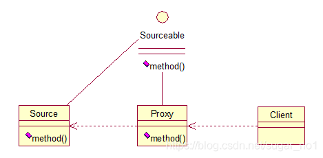

# 代理者模式（Proxy）

代理（Proxy）模式：为某对象提供一种代理以

控制对该对象的访问。即客户端通过代理间接地访问该对象，从而限制、增强或修改该对象的一些特性。比如我们在租房子的时候会去找中介，为什么呢？因为你对该地区房屋的信息掌握的不够全面，希望找一个更熟悉的人去帮你做，此处的代理就是这个意思。再如我们有的时候打官司，我们需要请律师，因为律师在法律方面有专长，可以替我们进行操作，表达我们的想法。先来看看关系图：



根据上文的阐述，代理模式就比较容易的理解了，我们看下代码：

```java
public interface Sourceable {
	public void method();
}
```

```java
public class Source implements Sourceable {
 
	@Override
	public void method() {
		System.out.println("the original method!");
	}
}
```

```java
public class Proxy implements Sourceable {
 
	private Source source;
	public Proxy(){
		super();
		this.source = new Source();
	}
	@Override
	public void method() {
		before();
		source.method();
		atfer();
	}
	private void atfer() {
		System.out.println("after proxy!");
	}
	private void before() {
		System.out.println("before proxy!");
	}
}
```

测试类：

```java
public class ProxyTest {
 
	public static void main(String[] args) {
		Sourceable source = new Proxy();
		source.method();
	}
 
}
```

输出：

before proxy!
the original method!
after proxy!

代理模式的应用场景：

如果已有的方法在使用的时候需要对原有的方法进行改进，此时有两种办法：

1. 修改原有的方法来适应。这样违反了“对扩展开放，对修改关闭”的原则。
2. 就是采用一个代理类调用原有的方法，且对产生的结果进行控制。这种方法就是代理模式。

使用代理模式，可以将功能划分的更加清晰，有助于后期维护！