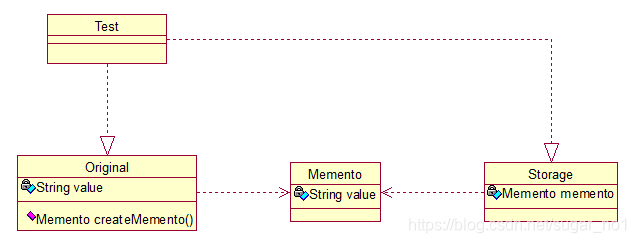

# **备忘录模式（Memento）**

备忘录（Memento）模式：在不破坏封装性的前提下，获取并保存一个对象的内部状态，以便以后恢复它。



Original类是原始类，里面有需要保存的属性value及创建一个备忘录类，用来保存value值。Memento类是备忘录类，Storage类是存储备忘录的类，持有Memento类的实例，该模式很好理解。直接看源码

```java
public class Original {
	
	private String value;
	
	public String getValue() {
		return value;
	}
 
	public void setValue(String value) {
		this.value = value;
	}
 
	public Original(String value) {
		this.value = value;
	}
 
	public Memento createMemento(){
		return new Memento(value);
	}
	
	public void restoreMemento(Memento memento){
		this.value = memento.getValue();
	}
}
```

```java
public class Memento {
	
	private String value;
 
	public Memento(String value) {
		this.value = value;
	}
 
	public String getValue() {
		return value;
	}
 
	public void setValue(String value) {
		this.value = value;
	}
}
```

```java
public class Storage {
	
	private Memento memento;
	
	public Storage(Memento memento) {
		this.memento = memento;
	}
 
	public Memento getMemento() {
		return memento;
	}
 
	public void setMemento(Memento memento) {
		this.memento = memento;
	}
}
```

 测试类：

```java
public class Test {
 
	public static void main(String[] args) {
		
		// 创建原始类
		Original origi = new Original("egg");
 
		// 创建备忘录
		Storage storage = new Storage(origi.createMemento());
 
		// 修改原始类的状态
		System.out.println("初始化状态为：" + origi.getValue());
		origi.setValue("niu");
		System.out.println("修改后的状态为：" + origi.getValue());
 
		// 回复原始类的状态
		origi.restoreMemento(storage.getMemento());
		System.out.println("恢复后的状态为：" + origi.getValue());
	}
}
```

输出：

初始化状态为：egg
修改后的状态为：niu
恢复后的状态为：egg

简单描述下：新建原始类时，value被初始化为egg，后经过修改，将value的值置为niu，最后倒数第二行进行恢复状态，结果成功恢复了。其实我觉得这个模式叫“备份-恢复”模式最形象。


问题 为什么要加中间那一个对象