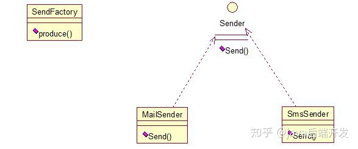

# 工厂模式

 

工厂模式就是事先定义好一类操作的结构，当不同的实现类来的时候返回不同的实现对象。

**1、工厂方法模式（Factory Method）**

+ 普通工厂模式

就是建立一个工厂类，对实现了同一接口的一些类进行实例的创建。首先看下关系图：



举例如下：（我们举一个发送邮件和短信的例子）

首先，创建二者的共同接口：

```java
public interface Sender { 
 public void Send(); 
}
```

其次，创建实现类：

```java
public class MailSender implements Sender { 
 	@Override 
 	public void Send() { 
 		System.out.println("this is mailsender!"); 
 	} 
}

public class SmsSender implements Sender { 
 @Override 
 public void Send() { 
 		System.out.println("this is sms sender!"); 
 } 
}
```

最后，建工厂类：

```java
public class Factory {

    public Sender produce(String type) {
        if ("mail".equals(type)) {
            return new MailSender();
        } else if ("sms".equals(type)) {
            return new SmsSender();
        } else {
            System.out.println("请输入正确的类型!");
            return null;
        }
    }
} 
```

我们来测试下：

```java
public class FactoryTest { 
 
 public static void main(String[] args) { 
 	SendFactory factory = new SendFactory(); 
 	Sender sender = factory.produce("sms"); 
 	sender.Send(); 
 } 
} 
```

+ **多个工厂方法模式**

该模式是对普通工厂方法模式的改进，在普通工厂方法模式中，如果传递的字符串出错，则不能正确创建对象，而多个工厂方法模式是提供多个工厂方法，分别创建对象。关系图：


将上面的代码做下修改，改动下SendFactory类就行，如下：

```java
public Sender produceMail() {
    return new MailSender();
}

public Sender produceSms() {
    return new SmsSender();
}
```

测试类如下：

```java
public class FactoryTest {

    public static void main(String[] args) {
        SendFactory factory = new SendFactory();
        Sender sender = factory.produceMail();
        sender.Send();
    }
}
```


+ 静态工厂方法模式

将上面的多个工厂方法模式里的方法置为静态的，不需要创建实例，直接调用即可。

```java
public class SendFactory {
    public static Sender produceMail() {
        return new MailSender();
    }

    public static Sender produceSms() {
        return new SmsSender();
    }
}

public class FactoryTest {
    public static void main(String[] args) {
        Sender sender = SendFactory.produceMail();
        sender.Send();
    }
} 
```

总体来说，工厂模式适合：凡是出现了大量的产品需要创建，并且具有共同的接口时，可以通过工厂方法模式进行创建。在以上的三种模式中，第一种如果传入的字符串有误，不能正确创建对象，第三种相对于第二种，不需要实例化工厂类，所以，大多数情况下，我们会选用第三种——静态工厂方法模式。


**2、抽象工厂模式（Abstract Factory）**

工厂方法模式有一个问题就是，类的创建依赖工厂类，也就是说，如果想要拓展程序，必须对工厂类进行修改，这违背了闭包原则，所以，从设计角度考虑，有一定的问题，如何解决？就用到抽象工厂模式，创建多个工厂类，这样一旦需要增加新的功能，直接增加新的工厂类就可以了，不需要修改之前的代码。因为抽象工厂不太好理解，我们先看看图，然后就和代码，就比较容易理解。

```java
 public interface Sender { 
 			public void Send(); 
 } 
```

两个实现类：

```java
public class MailSender implements Sender {
    @Override
    public void Send() {
        System.out.println("this is mailsender!");
    }
}

public class SmsSender implements Sender {

    @Override
    public void Send() {
        System.out.println("this is sms sender!");
    }
}
```

两个工厂类：

```java
public class SendMailFactory implements Provider {

    @Override
    public Sender produce() {
        return new MailSender();
    }
}

public class SendSmsFactory implements Provider {

    @Override
    public Sender produce() {
        return new SmsSender();
    }
} 
```


在提供一个接口：

```java
public interface Provider { 
 public Sender produce(); 
}
```


测试类：

```java
public class Test {

    public static void main(String[] args) {
        Provider provider = new SendMailFactory();
        Sender sender = provider.produce();
        sender.Send();
    }
} 
```

其实这个模式的好处就是，如果你现在想增加一个功能：发及时信息，则只需做一个实现类，实现Sender接口，同时做一个工厂类，实现Provider接口，就OK了，无需去改动现成的代码。这样做，拓展性较好！
