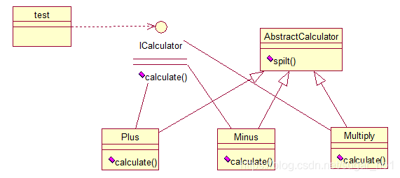

# **策略模式（strategy）**

策略（Strategy）模式：定义了一系列算法，并将每个算法封装起来，使它们可以相互替换，且算法的改变不会影响使用算法的客户。需要设计一个接口，为一系列实现类提供统一的方法，多个实现类实现该接口，设计一个抽象类（可有可无，属于辅助类），提供辅助函数，关系图如下：



 图中ICalculator提供统一的方法，AbstractCalculator是辅助类，提供辅助方法，接下来，依次实现下每个类：

首先统一接口：

```java
public interface ICalculator {
	public int calculate(String exp);
}
```

 辅助类：

```java
public abstract class AbstractCalculator {
	
	public int[] split(String exp,String opt){
		String array[] = exp.split(opt);
		int arrayInt[] = new int[2];
		arrayInt[0] = Integer.parseInt(array[0]);
		arrayInt[1] = Integer.parseInt(array[1]);
		return arrayInt;
	}
}
```

 三个实现类：

```java
public class Plus extends AbstractCalculator implements ICalculator {
 
	@Override
	public int calculate(String exp) {
		int arrayInt[] = split(exp,"\\+");
		return arrayInt[0]+arrayInt[1];
	}
}
```

```java
public class Minus extends AbstractCalculator implements ICalculator {
 
	@Override
	public int calculate(String exp) {
		int arrayInt[] = split(exp,"-");
		return arrayInt[0]-arrayInt[1];
	}
 
}
```

```java
public class Multiply extends AbstractCalculator implements ICalculator {
 
	@Override
	public int calculate(String exp) {
		int arrayInt[] = split(exp,"\\*");
		return arrayInt[0]*arrayInt[1];
	}
}
```

简单的测试类： 

```java
public class StrategyTest {
 
	public static void main(String[] args) {
		String exp = "2+8";
		ICalculator cal = new Plus();
		int result = cal.calculate(exp);
		System.out.println(result);
	}
}
```

输出：10

策略模式的决定权在用户，系统本身提供不同算法的实现，新增或者删除算法，对各种算法做封装。因此，策略模式多用在算法决策系统中，外部用户只需要决定用哪个算法即可。