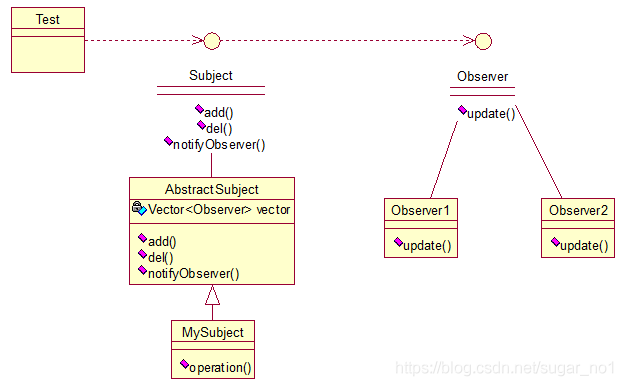

# **观察者模式（Observer）**

观察者（Observer）模式：多个对象间存在一对多关系，当一个对象发生改变时，会把这种改变通知给其他多个对象，从而影响其他对象的行为。先来看看关系图：



我解释下这些类的作用：MySubject类就是我们的主对象，Observer1和Observer2是依赖于MySubject的对象，当MySubject变化时，Observer1和Observer2必然变化。AbstractSubject类中定义着需要监控的对象列表，可以对其进行修改：增加或删除被监控对象，且当MySubject变化时，负责通知在列表内存在的对象。我们看实现代码：

一个Observer接口：

```java
public interface Observer {
	public void update();
}
```

 两个实现类：

```java
public class Observer1 implements Observer {
 
	@Override
	public void update() {
		System.out.println("observer1 has received!");
	}
}
```

```java
public class Observer2 implements Observer {
 
	@Override
	public void update() {
		System.out.println("observer2 has received!");
	}
}
```

 Subject接口及实现类：

```java
public interface Subject {
	
	/*增加观察者*/
	public void add(Observer observer);
	
	/*删除观察者*/
	public void del(Observer observer);
	
	/*通知所有的观察者*/
	public void notifyObservers();
	
	/*自身的操作*/
	public void operation();
}
```

```java
public abstract class AbstractSubject implements Subject {
 
	private Vector<Observer> vector = new Vector<Observer>();
	@Override
	public void add(Observer observer) {
		vector.add(observer);
	}
 
	@Override
	public void del(Observer observer) {
		vector.remove(observer);
	}
 
	@Override
	public void notifyObservers() {
		Enumeration<Observer> enumo = vector.elements();
		while(enumo.hasMoreElements()){
			enumo.nextElement().update();
		}
	}
}
```

```java
public class MySubject extends AbstractSubject {
 
	@Override
	public void operation() {
		System.out.println("update self!");
		notifyObservers();
	}
 
}
```


 测试类：

```java
public class ObserverTest {
 
	public static void main(String[] args) {
		Subject sub = new MySubject();
		sub.add(new Observer1());
		sub.add(new Observer2());
		
		sub.operation();
	}
 
}
```

输出：

update self!
observer1 has received!
observer2 has received!