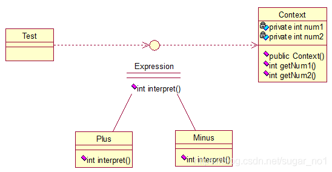

# **解释器模式（Interpreter）**

解释器（Interpreter）模式：提供如何定义语言的文法，以及对语言句子的解释方法，即解释器。一般主要应用在OOP开发中的编译器的开发中，所以适用面比较窄。



Context类是一个上下文环境类，Plus和Minus分别是用来计算的实现，代码如下：

```java
public interface Expression {
	public int interpret(Context context);
}
```

```java
public class Plus implements Expression {
 
	@Override
	public int interpret(Context context) {
		return context.getNum1()+context.getNum2();
	}
}	
```

```java
public class Minus implements Expression {
 
	@Override
	public int interpret(Context context) {
		return context.getNum1()-context.getNum2();
	}
}
```

```java
public class Context {
	
	private int num1;
	private int num2;
	
	public Context(int num1, int num2) {
		this.num1 = num1;
		this.num2 = num2;
	}
	
	public int getNum1() {
		return num1;
	}
	public void setNum1(int num1) {
		this.num1 = num1;
	}
	public int getNum2() {
		return num2;
	}
	public void setNum2(int num2) {
		this.num2 = num2;
	}
	
	
}
```


```java
public class Test {
 
	public static void main(String[] args) {
 
		// 计算9+2-8的值
		int result = new Minus().interpret((new Context(new Plus()
				.interpret(new Context(9, 2)), 8)));
		System.out.println(result);
	}
}
```

最后输出正确的结果：3。

基本就这样，解释器模式用来做[各种各样](https://www.baidu.com/s?wd=各种各样&tn=24004469_oem_dg&rsv_dl=gh_pl_sl_csd)的解释器，如正则表达式等的解释器等等！