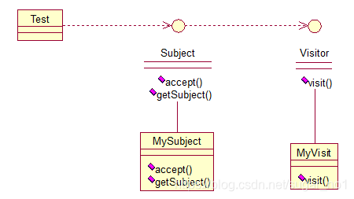

# **访问者模式（Visitor）** 

访问者（Visitor）模式：在不改变集合元素的前提下，为一个集合中的每个元素提供多种访问方式，即每个元素有多个访问者对象访问。

访问者模式把数据结构和作用于结构上的操作解耦合，使得操作集合可相对自由地演化。访问者模式适用于数据结构相对稳定算法又易变化的系统。因为访问者模式使得算法操作增加变得容易。若系统数据结构对象易于变化，经常有新的数据对象增加进来，则不适合使用访问者模式。访问者模式的优点是增加操作很容易，因为增加操作意味着增加新的访问者。访问者模式将有关行为集中到一个访问者对象中，其改变不影响系统数据结构。其缺点就是增加新的数据结构很困难。—— From 百科

简单来说，访问者模式就是一种分离对象数据结构与行为的方法，通过这种分离，可达到为一个被访问者动态添加新的操作而无需做其它的修改的效果。简单关系图：



来看看原码：一个Visitor类，存放要访问的对象，

```java
public interface Visitor {
	public void visit(Subject sub);
}
```

```java
public class MyVisitor implements Visitor {
 
	@Override
	public void visit(Subject sub) {
		System.out.println("visit the subject："+sub.getSubject());
	}
}
```

Subject类，accept方法，接受将要访问它的对象，getSubject()获取将要被访问的属性，

```java
public interface Subject {
	public void accept(Visitor visitor);
	public String getSubject();
}
```

```java
public class MySubject implements Subject {
 
	@Override
	public void accept(Visitor visitor) {
		visitor.visit(this);
	}
 
	@Override
	public String getSubject() {
		return "love";
	}
}
```

测试：

```java
public class Test {
 
	public static void main(String[] args) {
		
		Visitor visitor = new MyVisitor();
		Subject sub = new MySubject();
		sub.accept(visitor);	
	}
}
```


 输出：visit the subject：love

该模式适用场景：如果我们想为一个现有的类增加新功能，不得不考虑几个事情：

1. 新功能会不会与现有功能出现兼容性问题？
2. 以后会不会再需要添加？
3. 如果类不允许修改代码怎么办？

面对这些问题，最好的解决方法就是使用访问者模式，访问者模式适用于数据结构相对稳定的系统，把数据结构和算法解耦。