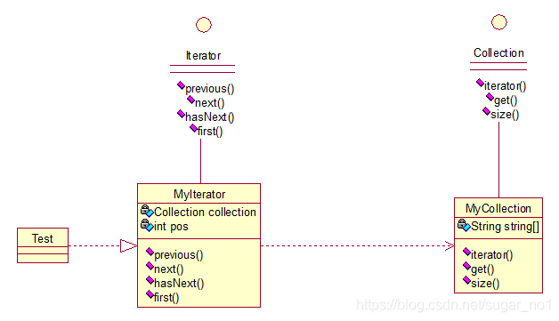

#  **迭代子模式（Iterator）**

迭代器（Iterator）模式：提供一种方法来顺序访问聚合对象中的一系列数据，而不暴露聚合对象的内部表示。这句话包含两层意思：一是需要遍历的对象，即聚集对象，二是迭代器对象，用于对聚集对象进行遍历访问。我们看下关系图：



这个思路和我们常用的一模一样，MyCollection中定义了集合的一些操作，MyIterator中定义了一系列迭代操作，且持有Collection实例，我们来看看实现代码：

两个接口：

```java
public interface Collection {
	
	public Iterator iterator();
	
	/*取得集合元素*/
	public Object get(int i);
	
	/*取得集合大小*/
	public int size();
}
```

```java
public interface Iterator {
	//前移
	public Object previous();
	
	//后移
	public Object next();
	public boolean hasNext();
	
	//取得第一个元素
	public Object first();
}
```

 两个实现：

```java
public class MyIterator implements Iterator {
 
	private Collection collection;
	private int pos = -1;
	
	public MyIterator(Collection collection){
		this.collection = collection;
	}
	
	@Override
	public Object previous() {
		if(pos > 0){
			pos--;
		}
		return collection.get(pos);
	}
 
	@Override
	public Object next() {
		if(pos<collection.size()-1){
			pos++;
		}
		return collection.get(pos);
	}
 
	@Override
	public boolean hasNext() {
		if(pos<collection.size()-1){
			return true;
		}else{
			return false;
		}
	}
 
	@Override
	public Object first() {
		pos = 0;
		return collection.get(pos);
	}
 
}
```

```java
public class MyCollection implements Collection {
 
	public String string[] = {"A","B","C","D","E"};
	@Override
	public Iterator iterator() {
		return new MyIterator(this);
	}
 
	@Override
	public Object get(int i) {
		return string[i];
	}
 
	@Override
	public int size() {
		return string.length;
	}
}
```

 测试类：

```java
public class Test {
 
	public static void main(String[] args) {
		Collection collection = new MyCollection();
		Iterator it = collection.iterator();
		
		while(it.hasNext()){
			System.out.println(it.next());
		}
	}
}
```

输出：A B C D E

此处我们貌似[模拟](https://www.baidu.com/s?wd=模拟&tn=24004469_oem_dg&rsv_dl=gh_pl_sl_csd)了一个集合类的过程，感觉是不是很爽？其实JDK中各个类也都是这些基本的东西，加一些设计模式，再加一些优化放到一起的，只要我们把这些东西学会了，掌握好了，我们也可以写出自己的集合类，甚至框架！