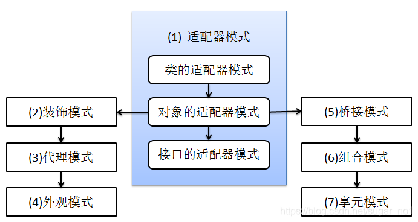
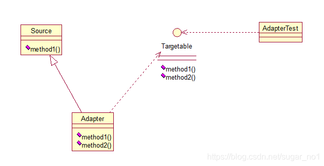
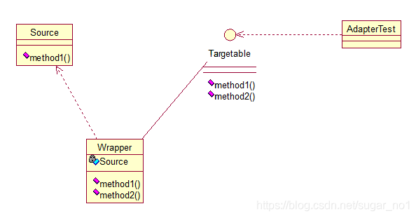
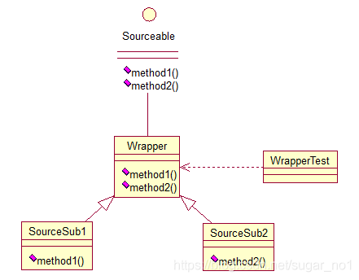

# 适配器模式（Adapter）



适配器模式将某个类的接口转换成客户端期望的另一个接口表示，目的是消除由于接口不匹配所造成的类的兼容性问题。主要分为三类：类的适配器模式、对象的适配器模式、接口的适配器模式。首先，我们来看看**类的适配器模式**，先看类图：



核心思想就是：有一个Source类，拥有一个方法，待适配，目标接口是Targetable，通过Adapter类，将Source的功能扩展到Targetable里，看代码：

```java
public class Source {
 
	public void method1() {
		System.out.println("this is original method!");
	}
}
```

```java
public interface Targetable {
 
	/* 与原类中的方法相同 */
	public void method1();
 
	/* 新类的方法 */
	public void method2();
}	
```

```java
public class Adapter extends Source implements Targetable {
 
	@Override
	public void method2() {
		System.out.println("this is the targetable method!");
	}
}
```

Adapter类继承Source类，实现Targetable接口，下面是测试类：

```java
public class AdapterTest {
 
	public static void main(String[] args) {
		Targetable target = new Adapter();
		target.method1();
		target.method2();
	}
}
```

输出：

this is original method!
this is the targetable method!

这样Targetable接口的实现类就具有了Source类的功能。


**对象的适配器模式**

基本思路和类的适配器模式相同，只是将Adapter类作修改，这次不继承Source类，而是持有Source类的实例，以达到解决兼容性的问题。看图：



只需要修改Adapter类的源码即可：

```java
public class Wrapper implements Targetable {
 
	private Source source;
	
	public Wrapper(Source source){
		super(); 
		this.source = source;
	}
	@Override
	public void method2() {
		System.out.println("this is the targetable method!");
	}
 
	@Override
	public void method1() {
		source.method1();
	}
}
```

测试类：

```java
public class AdapterTest {
 
	public static void main(String[] args) {
		Source source = new Source();
		Targetable target = new Wrapper(source);
		target.method1();
		target.method2();
	}
}
```

输出与第一种一样，只是适配的方法不同而已。

第三种适配器模式是**接口的适配器模式**，接口的适配器是这样的：有时我们写的一个接口中有多个抽象方法，当我们写该接口的实现类时，必须实现该接口的所有方法，这明显有时比较浪费，因为并不是所有的方法都是我们需要的，有时只需要某一些，此处为了解决这个问题，我们引入了接口的适配器模式，借助于一个抽象类，该抽象类实现了该接口，实现了所有的方法，而我们不和原始的接口打交道，只和该抽象类取得联系，所以我们写一个类，继承该抽象类，重写我们需要的方法就行。看一下类图：



这个很好理解，在实际开发中，我们也常会遇到这种接口中定义了太多的方法，以致于有时我们在一些实现类中并不是都需要。看代码：

```java
public interface Sourceable {
	
	public void method1();
	public void method2();
}
```

抽象类Wrapper2：

```java
public abstract class Wrapper2 implements Sourceable{
	
	public void method1(){}
	public void method2(){}
}
```

```java
public class SourceSub1 extends Wrapper2 {
	public void method1(){
		System.out.println("the sourceable interface's first Sub1!");
	}
}
```

```java
public class SourceSub2 extends Wrapper2 {
	public void method2(){
		System.out.println("the sourceable interface's second Sub2!");
	}
}
```

```java
public class WrapperTest {
 
	public static void main(String[] args) {
		Sourceable source1 = new SourceSub1();
		Sourceable source2 = new SourceSub2();
		
		source1.method1();
		source1.method2();
		source2.method1();
		source2.method2();
	}
}
```

测试输出：

the sourceable interface's first Sub1!
the sourceable interface's second Sub2!

达到了我们的效果！

 讲了这么多，总结一下三种适配器模式的应用场景：

类的适配器模式：当希望将**一个类**转换成满足**另一个新接口**的类时，可以使用类的适配器模式，创建一个新类，继承原有的类，实现新的接口即可。

对象的适配器模式：当希望将**一个对象**转换成满足**另一个新接口**的对象时，可以创建一个Wrapper类，持有原类的一个实例，在Wrapper类的方法中，调用实例的方法就行。

接口的适配器模式：**当不希望实现一个接口中所有的方法时**，可以创建一个抽象类Wrapper，实现所有方法，我们写别的类的时候，继承抽象类即可。


